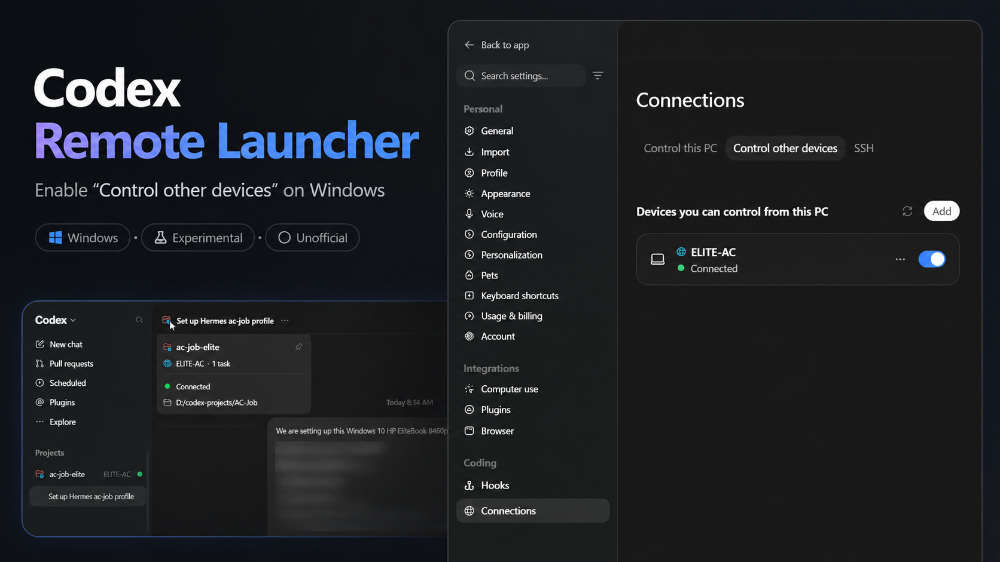
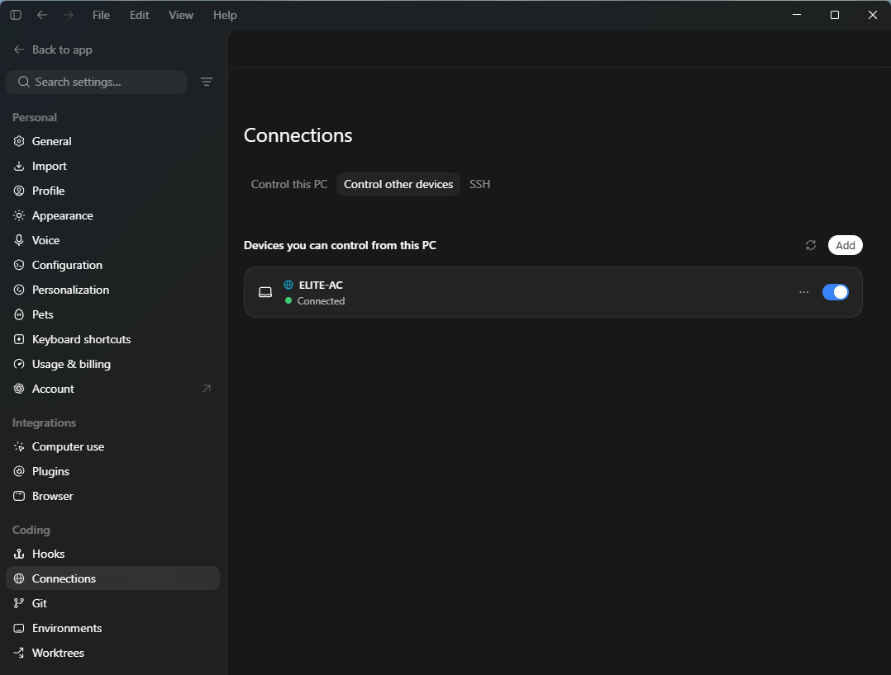
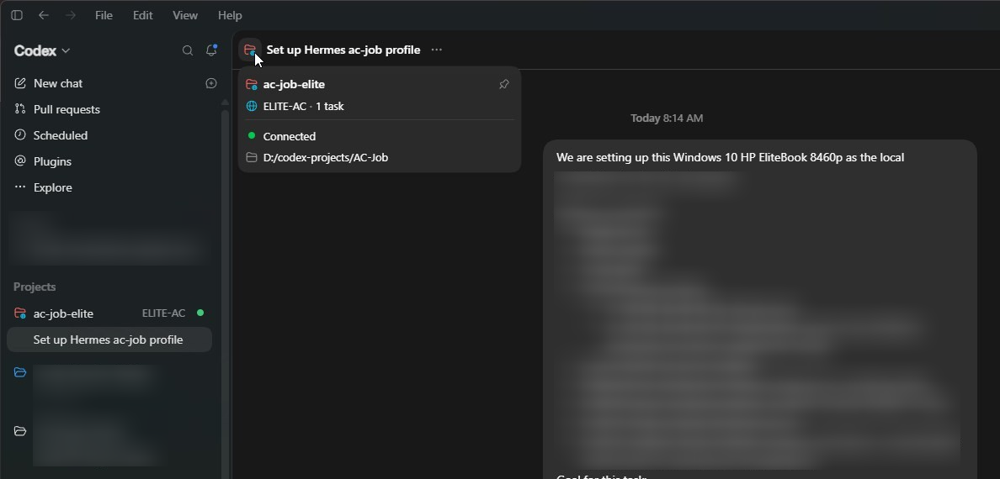

# Codex Remote Launcher

Codex Remote Launcher is an unofficial Windows launcher for Codex Desktop. It
starts Codex in the required debug/Special configuration and applies a small
runtime bridge so the shipped `Settings → Connections → Control other devices`
functionality can appear and work on affected Windows builds.

This project does not patch `ChatGPT.exe`, modify `app.asar`, or change files
under `C:\Program Files\WindowsApps`. The tested configuration does not require
Administrator privileges.

This relies on undocumented and internal Codex behavior. Future Codex updates
may break it. It is not supported, endorsed, or affiliated with OpenAI.



## Working on Windows

Tested successfully with Codex Desktop `26.825.6671.0` on Windows.

### Control other devices enabled



`Control other devices` is visible under `Settings → Connections`, with a
remote Windows device connected.

### Remote project connected and usable



The remote project is available directly inside Codex Desktop and can be used
interactively from the controlling Windows PC.

## Why this exists

Earlier work showed that Codex’s remote-control functionality can work on
Windows, but process takeover and lifecycle recovery add substantial
complexity. This project intentionally follows one small, explicit path:

`Codex closed → launcher → Special Codex → runtime bridge → remote enabled`

If ordinary Codex is already running, the launcher refuses safely. It does not
kill or take over the existing process.

## Requirements

- Windows with Codex Desktop installed from the Microsoft Store/MSIX package.
- A per-user bundled Node runtime supplied by the Codex installation.
- A signed-in Codex account and any account/workspace authorization required by
  Codex remote control.
- The final confirmed validation used Codex Desktop `26.825.6671.0` on
  Windows; compatibility must be checked after every Codex update.
- No Administrator privileges are required in the tested configuration.

Do not infer broad Windows or Codex-version compatibility from these results.

## Usage

1. Close Codex completely.
2. Run `CodexRemoteLauncher.exe`, or the `Codex Remote` desktop shortcut.
3. Open `Settings → Connections`.
4. Enable or use `Control other devices`.

If Codex is already running, the launcher exits safely and displays:

`Close Codex first, then run Codex Remote.`

The launcher performs no automatic retry.

## Architecture

The current launcher-only path is:

- package and `app.asar` compatibility verification;
- the per-user Codex Node runtime;
- loopback-only temporary debug ports;
- direct Special Codex launch;
- the orchestrator/runtime bridge;
- bridge-proof verification;
- an `Active` result after the proof succeeds.

The current design intentionally has none of the following:

- no watcher;
- no ordinary-process takeover;
- no lifecycle journal or replay;
- no installer or runtime-generation switching;
- no background service;
- no Administrator elevation requirement.

## Security and safety

- Debugging endpoints bind to `127.0.0.1` only.
- The launcher does not modify WindowsApps ACLs or ownership.
- It does not patch executables or `app.asar`.
- An existing Codex process is never killed by the launcher.
- Package compatibility verification is fail-closed.
- There is no automatic retry loop.
- Debug ports can execute code inside the Codex process; use this only on a
  trusted Windows machine and close Codex before returning to normal use.

## Troubleshooting

### Launcher says Codex is already running

Close Codex fully, then run the launcher again. The launcher intentionally does
not take over an existing process.

### Package verification fails

Inspect `logs\launcher.log` and `logs\launcher-crash.log`. The compatibility
checker validates the installed package before Special launch. A failure is a
stop condition; do not bypass it or modify the WindowsApps installation.

### Access denied when launching Node

The launcher deliberately uses Codex’s per-user bundled Node runtime rather
than trying to execute a protected Node binary inside WindowsApps. Confirm the
configured per-user runtime exists and rerun `--verify-only`.

### Codex launches but Control other devices is missing

Inspect the logs for `SpecialLaunch`, `SpecialLaunchConfirmed`, `Orchestrator`,
and `Active`. Also confirm that the package check succeeded. Do not take
ownership of WindowsApps or change its ACLs.

## Logging

Runtime logs are kept under `logs\`:

- `launcher.log` — normal guard, package, Special-launch, and orchestrator events;
- `launcher-crash.log` — user-visible activation failures and crash details.

Logs are rotated at approximately 1 MiB with one `.1` file retained. Logs and
local state are intentionally excluded from the distributable release bundle.

## Development and build

The release executable is built from the launcher sources in `src\launcher`.
The supplied `BUILD-RELEASE.ps1` uses the installed .NET Framework C# compiler
(`csc.exe`) because the .NET SDK is not required by this project.

From the project directory:

```powershell
.\BUILD-RELEASE.ps1
```

Use `CodexRemoteLauncher.exe --verify-only` to run package compatibility
verification without launching Codex.

The checked-in `state\launcher-settings.example.json` documents the two local
paths required by the current launcher. A local installation must provide
`state\launcher-settings.json` for its installed Codex package and bundled
Node runtime; that machine-specific file is deliberately not included in the
release bundle.

## Credits and acknowledgements

This project is not an official OpenAI product. Its investigation and runtime
techniques were informed by:

- [naipi11/CodexRemote-fix](https://github.com/naipi11/CodexRemote-fix), which is
  MIT-licensed;
- [hunterbeach’s Codex Windows runtime remote-control gist](https://gist.github.com/hunterbeach/dc4b74bda0e045e33f308099182b4f80),
  credited as original research/reference. No explicit license notice was
  identified on that gist, so this project does not treat its text as licensed
  reusable code.

The standalone implementation uses ideas and techniques derived from that
work, but replaces the lifecycle/takeover architecture with a minimal direct-
launch .NET approach. The runtime bridge in this bundle is maintained as the
standalone project’s own implementation.

## Project status

**Experimental.** Confirmed on Windows with the direct launcher: Codex Desktop
remote-control UI appeared, Control other devices was usable, and a remote
project accepted real-time text updates. Recheck compatibility after each
Codex update.

## License

The original code in this standalone project is released under the MIT License;
see `LICENSE`. Third-party names and references remain the property of their
respective authors. This project does not redistribute OpenAI binaries or
assets.
